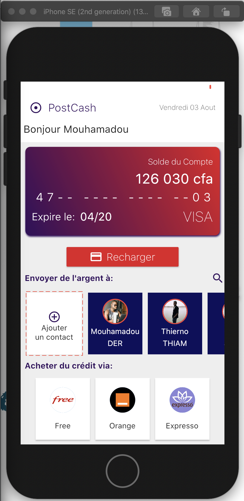

# postcash

A demo App with Flutter.

Design from : https://www.behance.net/gallery/68748807/PostCash-redesign-concept

Thx to Mohamadou DER

## Getting Started

This project is a starting point for a Flutter application.

A few resources to get you started if this is your first Flutter project:

- [Lab: Write your first Flutter app](https://flutter.dev/docs/get-started/codelab)
- [Cookbook: Useful Flutter samples](https://flutter.dev/docs/cookbook)

For help getting started with Flutter, view our
[online documentation](https://flutter.dev/docs), which offers tutorials,
samples, guidance on mobile development, and a full API reference.
# postcash

- Design App

- Code App

